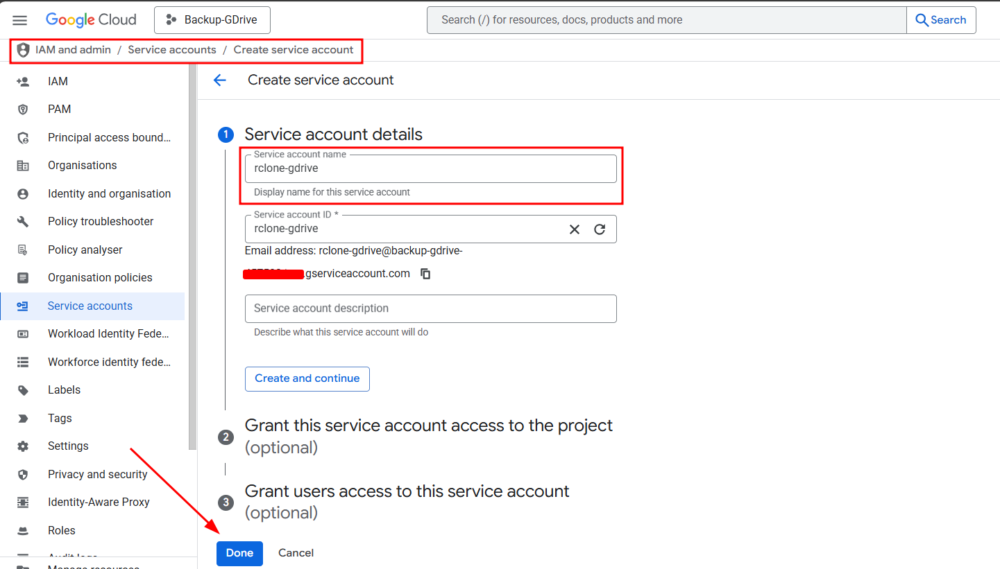
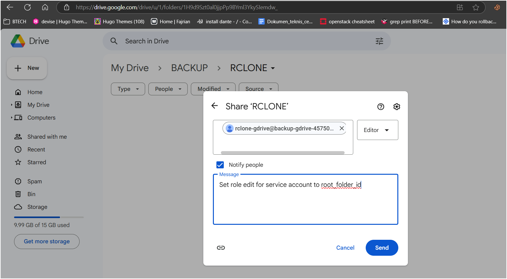
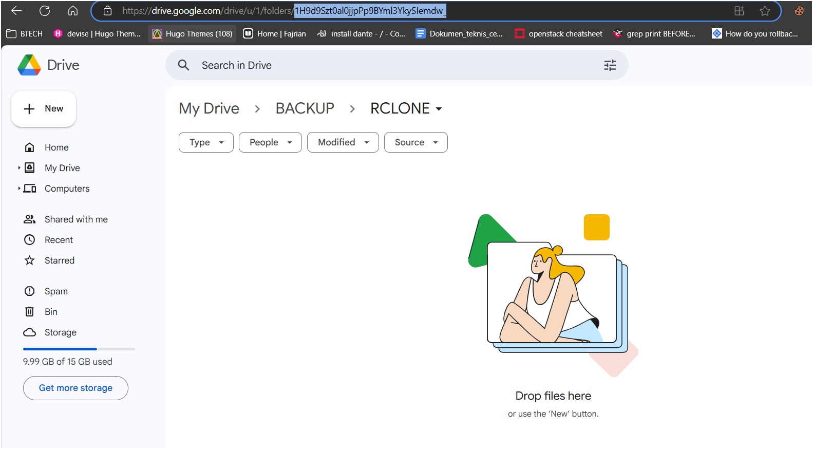

# 🔐 Backup to Google Drive Using Rclone and a Service Account

When managing server backups, automation and reliability are key. While Rclone offers two ways to connect to Google Drive—via OAuth token or service account—**using a service account is much better for automated system-level backups**, as it never expires and doesn’t require user interaction.

In this post, I’ll walk you through the steps to set up Google Drive backups using Rclone and a Google Cloud service account.

---

## ✅ Why Service Account Over OAuth Token?

- **Tokens expire** – Service accounts don’t.
- **Non-interactive** – Perfect for cronjobs and scripts.
- **Scoped access** – Least privilege can be applied.

---

## 🛠 Step-by-Step Setup

### 📁 1. Create a Service Account on Google Cloud

1. Go to the [Google Cloud Console](https://console.developers.google.com).
2. Create a new project — e.g., `Backup-GDrive`.
3. Navigate to:
   ```
   IAM & Admin → Service Accounts → Create Service Account
   ```

> 💡 Skip Steps 2 and 3 during creation since we don’t need complex permissions.



4. After creating it:
   - Go to your service account.
   - Click **“Keys” → “Add Key” → “Create new key” → Select JSON → Create**.
   - Download the JSON key.

```bash
# Transfer the JSON file to your server
scp backup-gdrive-xxx.json yourserver@your-ip:~/backup-gdrive/
```

---

### 🔌 2. Enable Google Drive API

1. In the same GCP project, go to:
   ```
   API & Services → Enable APIs & Services → Search “Google Drive API” → Enable
   ```

---

### 📦 3. Install Rclone on Your Server

```bash
# Install Rclone
sudo -v ; curl https://rclone.org/install.sh | sudo bash

# Verify installation
rclone --version
```

---

### ⚙️ 4. Configure Rclone with Service Account

```bash
rclone config
```

Follow the prompts:

```
n) New remote
name> gdrive-sa
Storage> 20    # Select Google Drive

client_id>         # Leave blank
client_secret>     # Leave blank
scope> 1           # Full access

service_account_file> /root/backup-gdrive/backup-gdrive-xxx.json
root_folder_id> 1H9d9Szt0al0jjpPp9BYml3YkySIemdw_  # optional, for specific folder
use_trash> false
team_drive> n
```

✅ Confirm the configuration.

---

### 📝 Permissions Note

Your service account must have at least **Editor** access to the target Google Drive folder.

```json
{
  "client_email": "rclone-gdrive@backup-gdrive-xxxx.iam.gserviceaccount.com"
}
```

In Google Drive:
- Right-click the folder → Share → Add the `client_email` above as an editor.



---

### 📌 How to Get `root_folder_id`

Open the target folder in your browser. The URL will look like:

```
https://drive.google.com/drive/folders/1H9d9Szt0al0jjpPp9BYml3YkySIemdw_
```

Copy the ID from the URL — that’s your `root_folder_id`.



---

## ✅ Verify Your Setup

```bash
# Upload test file
touch bot.log
rclone copy -P bot.log gdrive-sa:

# List files in root folder
rclone ls gdrive-sa:

# Delete file
rclone delete gdrive-sa:bot.log
```

---

## 🔄 Real-World Use: Backup VPN Config Automatically

Here's an example script to back up your SSTP VPN config file:

```bash
/usr/bin/rclone delete gdrive-sa:vpn_server.config
/usr/bin/rclone copy -P /usr/local/softether/vpn_server.config gdrive-sa:
```

Use this in a cronjob to keep backups up to date.

---

## 🧩 Wrapping Up

Using a service account with Rclone makes Google Drive a rock-solid solution for secure, automated, and reliable cloud backups. Set it up once, and you’ve got peace of mind forever.