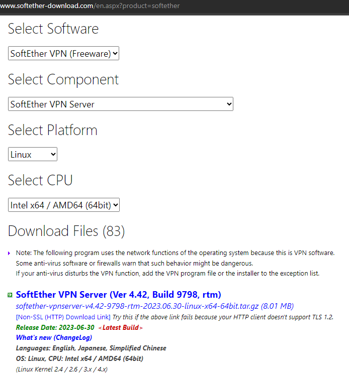
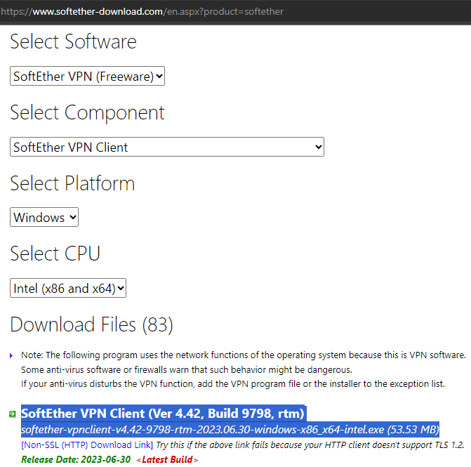
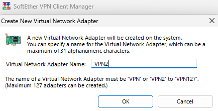
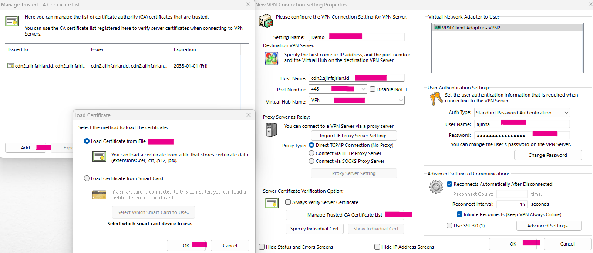

### Why choose SSTP VPN
Currently, I work in the finance industry with a high level of security system, the network engineer implement DPI(Deep Packet Inspection) in the network architecture, Which allows them to block or restrict access to certain websites, applications, and services(including SSH). 

Working within an environment where Wi-Fi access comes with a maze of permissions and corporate firewalls only permit communication through ports 80 and 443. and entertainment platform such as youtube, spotify, and reddit. 

#### Prerequisites

- VPS with IP public
- Port TCP/443 is open

### Pre Installing Softether Server
1. Upgrade & Install Depedencies
```sh
$ sudo apt-get update && sudo apt-get -y upgrade && sudo apt install -y wget build-essential nano tar acl
```



### Installing Softether Server
1. Download softether package
```sh
$ wget "http://www.softether-download.com/files/softether/v4.34-9745-rtm-2020.04.05-tree/Linux/SoftEther_VPN_Server/64bit_-_Intel_x64_or_AMD64/softether-vpnserver-v4.34-9745-rtm-2020.04.05-linux-x64-64bit.tar.gz" -O softether-vpnserver-linux.tar.gz
```

2. Extract softether
```sh
$ tar -xvf softether-vpnserver-linux.tar.gz
```

3. Move the directory
```sh
$ sudo mv vpnserver /usr/local && cd /usr/local/vpnserver
$ make
```

4. Change permission
```sh
$ chmod 600 * && chmod 700 vpnserver && chmod 700 vpncmd
```

5. Create user for limit permission
```sh
sudo adduser vpn --shell /usr/sbin/nologin
sudo setfacl -m user:vpn:rwx -R /usr/local/vpnserver 
```

6. Create systemd service for autostart after reboot
```sh
$ sudo vi /etc/systemd/system/softether-vpn.service
```

```yaml
[Unit]
Description=SoftEther VPN server
After=network-online.target
After=dbus.service

[Service]
Type=forking
User=vpn
Group=vpn
ExecStart=/usr/local/vpnserver/vpnserver start
ExecReload=/bin/kill -HUP $MAINPID
# Maximum number of restart is 5, and attempts for every 60 seconds
StartLimitBurst=5
StartLimitInterval=60

[Install]
WantedBy=multi-user.target
```

7. Permit the binary to open port under 1024
The binary will open port TCP/443 without root permission
```sh
$ sudo setcap 'CAP_NET_BIND_SERVICE=+eip CAP_NET_RAW=+eip' /usr/local/vpnserver/vpnserver
$ sudo getcap /usr/local/vpnserver/vpnserver
```

8. Reload and start service after reboot
```sh
$ sudo systemctl daemon-reload && sudo systemctl enable --now softether-vpn.service
```

### Post Installation Softether Server
#### Create vpn user and vpn config
1. Login to vpncmd, for system requirement checking
```sh
$ bash /usr/local/vpnserver/vpncmd
```
```sh
1. Management of VPN Server or VPN Bridge
2. Management of VPN Client
3. Use of VPN Tools (certificate creation and Network Traffic Speed Test Tool)

typing number: 3
typing letters: check
typing letters: exit
```

2. Set password for administrator
```sh
$ bash /usr/local/vpnserver/vpncmd
```
```yaml
1. Management of VPN Server or VPN Bridge
2. Management of VPN Client
3. Use of VPN Tools (certificate creation and Network Traffic Speed Test Tool)

typing number: 1
Hostname of IP Address of Destination: ↵
Specify Virtual Hub Name:  ↵

VPN Server> ServerPasswordSet
```

3. Relogin to vpncmd, and create a virtual hub
```sh
$ bash /usr/local/vpnserver/vpncmd
```
```sh

type 1 (management vpn server)
typing letters: HubCreate VPN
typing letters: Hub VPN
typing letters: SecureNatEnable
```

4. Relogin to vpncmd, and create a user
```sh
$ bash /usr/local/vpnserver/vpncmd
```
```sh
type 1 (management vpn server)
# <blank or 443 depends on your port config>
Hostname of IP Address of Destination: ↵
Specify Virtual Hub Name: VPN
typing letters: UserCreate ubuntu
typing letters: UserPasswordSet ubuntu
```

5. Relogin to vpncmd, and create a certificate
```sh
$ bash /usr/local/vpnserver/vpncmd
```
```sh
type 1 (management vpn server)
Hostname of IP Address of Destination: ↵
Specify Virtual Hub Name: VPN
typing letters: IPsecEnable

enable l2tp: yes
enable raw l2tp: yes
enable ipsec: yes
preshared key ipsec: <your_ipsec_pass>
default virtualhub: VPN

# you can write ip or dns(pointing your ip first before using dns cert)
typing letters: ServerCertRegenerate 172.104.48.41 or sstp.ajinfajrian.id
typing letters: ServerCertGet ~/cert.cer
typing letters: SstpEnable yes
typing letters: ServerKeyGet ~/privatekey.key
typing letters: SetEnumDeny # for hardening

exit
```

#### Optional
1. for mikrotik router sstp client

create a new `cert.key` for mikrotik
```sh
$ bash /usr/local/vpnserver/vpncmd
```
```sh
type 1 (management vpn server)
Hostname of IP Address of Destination: <blank or 443 depends on your port config>
Specify Virtual Hub Name: VPN
Password: <your_password>

VPN Server> ServerKeyGet ~/privkey.key
```

2. Hardening web api softether

Prevent anonymous user to accessing public web api softether server
```sh
sudo systemctl stop softether-vpn.service
sudo sed -i 's/DisableJsonRpcWebApi false/DisableJsonRpcWebApi true/g' vpn_server.config
sudo systemctl start softether-vpn.service
```

3. Hardening VirtualHub with Password
```sh
$ bash /usr/local/vpnserver/vpncmd
```
```sh
type 1 (management vpn server)
Hostname of IP Address of Destination: <blank or 443 depends on your port config>
Specify Virtual Hub Name: VPN
Password: <your_password>

VPN Server> SetHubPassword VPN
```


#### Troubleshoot 
1. Selinux context
```yaml
softether.service: Failed to locate executable /usr/local/vpnserver/vpnserver: Permission denied
SELinux is preventing /usr/lib/systemd/systemd from execute access on the file vpnserver.
```

```sh
chcon -R -t bin_t /usr/local/vpnserver/
semanage fcontext -a -t bin_t "/usr/local/vpnserver(/.*)?"
restorecon -r -v /usr/local/vpnserver/
```


### Installing Softether Client Windows
1. Download softether client from this [link](https://www.softether-download.com/en.aspx?product=softether)


2. Install softether client
<div align="center">
    
</div>

3. Create new virtual network adapter \
After installation's completed, then create a new virtual network adapter with name `VPN2`
<div align="center">
    
</div>

4. Add VPN Connection

- Edit `Setting Name`
- Change with your `Hostname` and `Port Number`
- Edit `Virtual Hub Name` to `VPN`
- Import and `Manage Trusted CA` with your CA
- Change `User Name` and `Password`
- OK

### Source
- https://www.kangarif.net/2020/11/cara-install-softether.html
- https://protonvpn.com/blog/deep-packet-inspection