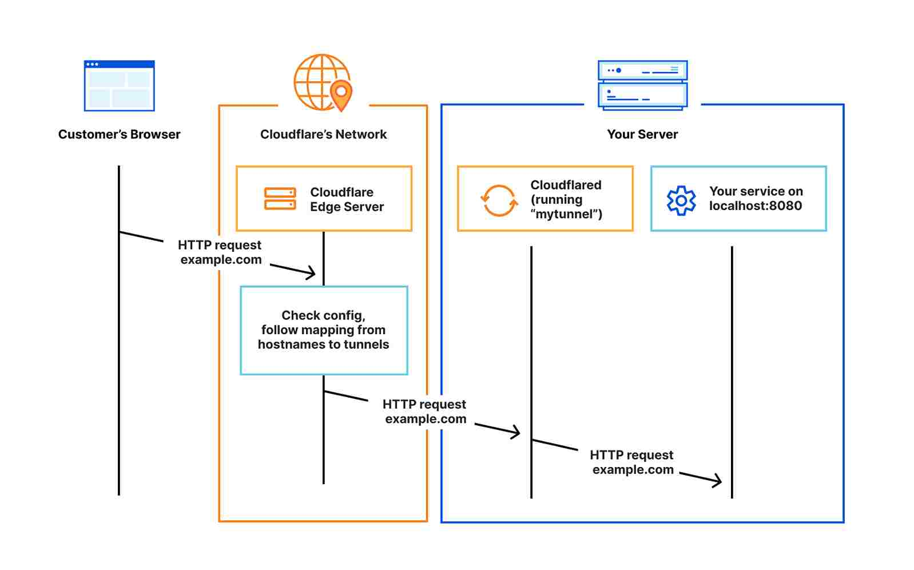
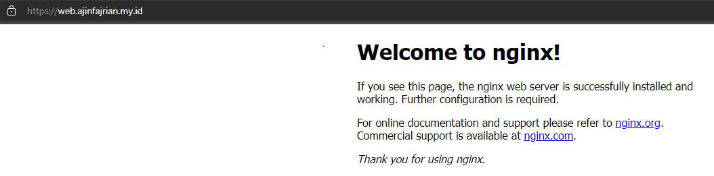

### What is Cloudflare Tunnel

Cloudflare Tunnel provides you with a secure way to connect your resources to Cloudflare without a publicly routable IP address. Cloudflare Tunnel can connect HTTP web servers, [SSH servers](https://developers.cloudflare.com/cloudflare-one/connections/connect-apps/use_cases/ssh/), [remote desktops](https://developers.cloudflare.com/cloudflare-one/connections/connect-apps/use_cases/rdp/), and other protocols safely to Cloudflare.



#### Prerequisites

- Domain name
- A Cloudflare account
- Cloudflared service

### Installing Cloudflared

I assume that you're already pointing your domain nameserver to Cloudflare. If you don't, you can check [cloudflare documentation](https://developers.cloudflare.com/fundamentals/get-started/setup/add-site/).

- If you're using **linux os** (amd64)

  - **ubuntu** distro
  ```python
  $ wget https://github.com/cloudflare/cloudflared/releases/latest/download/cloudflared-linux-amd64.deb
  $ sudo dpkg -i cloudflared-linux-amd64.deb
  $ cloudflared --version
  ```
  - **rhel** distro
  ```python
  $ wget https://github.com/cloudflare/cloudflared/releases/latest/download/cloudflared-linux-x86_64.rpm
  $ sudo rpm -i cloudflared-linux-x86_64.rpm
  $ cloudflared --version
  ```

- If you're using **macOS**

```python
$ brew install cloudflared
```

#### Login to Cloudflared
After Cloudflared installation's complete, we should be able to login into cloudflare dashboard.

```python
$ cloudflared login
```

Copy url on the cli, and paste it to your browser. Then choose whatever site that you want for tunneling.

> Cloudflared will generate a new `cert.pem` file in `~/.cloudflared` folder.

### Create Tunnel
Create a new tunnel and pointing a subdomain to the tunnel. and make sure the subdomain doesn't exist.

```sh
$ cloudflared tunnel create example-tunnel
$ cloudflared tunnel list
$ cloudflared tunnel route dns example-tunnel web.example.com
```

After you've created a tunnel, you will have a subdomain from `cfargotunnel.com` with UUID at `~/.cloudflared`

read more [DNS record · Cloudflare Zero Trust docs](https://developers.cloudflare.com/cloudflare-one/connections/connect-apps/routing-to-tunnel/dns/)

### Create ingress rules
Maybe is a kinda reverse proxy. So incoming packets with matching rules would be forwarded to a specific port.

```yaml
tunnel: <uuid_without_json_format>
credentials-file: /home/<your_user>/.cloudflared/<uuid_tunnel>.json
origincert: /home/<your_user>/.cloudflared/cert.pem
log-directory: /var/log/cloudflared
ingress:
  - hostname: ssh.example.com
    service: ssh://localhost:22
  - hostname: web.example.com
    service: http://localhost:80
  - service: http_status:404
```

read more [Ingress rules · Cloudflare Zero Trust docs](https://developers.cloudflare.com/cloudflare-one/connections/connect-apps/install-and-setup/tunnel-guide/local/local-management/ingress/)

### Running Cloudflared tunnel as a daemonize service

```c
$ sudo sudo cloudflared --config /home/<your_user>/.cloudflared/config.yaml service install
# OR
$ sudo cloudflared service install
$ sudo systemctl enable --now cloudflared
```

#### Verify



Yeayy.. You're succeed exposing behind NAT service to the internet.


### Extras
If you want to connect to your home lab with ssh protocol, as a client you should have [cloudflared installed](#install-cloudflared), for both home lab server and laptop.

On **server side**, enable service sshd server:
```sh
$ sudo systemctl enable --now sshd
```

Edit ssh configuration file on **client side**:
```sh
$ vi ~/.ssh/config
```

Input the following values:
```html
Host ssh.example.com
ProxyCommand /usr/local/bin/cloudflared access ssh --hostname %h
```
The cloudflared path may be different depending on your OS and package manager. For locating cloudflared path you can use this command:
```sh
$ which cloudflared
```
And now test the connection by running a command to reach the service:
```
$ ssh <username>@ssh.example.com
```

#### Summary

You can expose or access your home lab using cloudflare tunnel for free. As long as you have internet and electric power.

#### Sources
- [What's cloudflare tunnel](https://developers.cloudflare.com/cloudflare-one/connections/connect-apps/)
- [Ingress rules · Cloudflare Zero Trust docs](https://developers.cloudflare.com/cloudflare-one/connections/connect-apps/install-and-setup/tunnel-guide/local/local-management/ingress/)
- [DNS record · Cloudflare Zero Trust docs](https://developers.cloudflare.com/cloudflare-one/connections/connect-apps/routing-to-tunnel/dns/)
