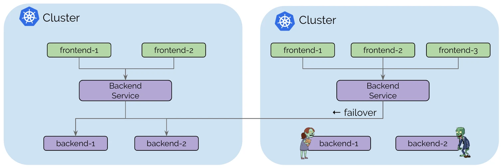

after long time never had motivation to write a post. recently, i have some interest on high availability. \

cilium clustermesh can works as active-active high availability cluster, Upon failure, requests can fail over to other clusters.

<div align="center">
    
    [Use Case: High Availability](cilium.io/static/04d2d06e7e32665b74c968a9f7fc0a40/832a9/usecase_ha.png)
</div>

### Prerequisites

> 1.) All clusters must be configured with the same datapath mode. Cilium install may default to [Encapsulation](https://docs.cilium.io/en/latest/network/concepts/routing/#arch-overlay) or [Native-Routing](https://docs.cilium.io/en/latest/network/concepts/routing/#native-routing) mode depending on the specific cloud environment.
> 2.) PodCIDR ranges in all clusters and all nodes must be non-conflicting and unique IP addresses.
> 3.) Nodes in all clusters must have IP connectivity between each other using the configured InternalIP for each node. This requirement is typically met by establishing peering or VPN tunnels between the networks of the nodes of each cluster.
> 4.) The network between clusters must allow the inter-cluster communication. The exact ports are documented in the [Firewall Rules section](https://docs.cilium.io/en/stable/operations/system_requirements/#firewall-rules).

for point 1, im using encapsulation mode (easy setup) instead of native-routing. its because went you want using native-routing you should configuring complex routing to enable pod-to-pod communication such as [kube-router bgp integrations](https://docs.cilium.io/en/stable/network/kube-router/).

for point 3, i will use wireguard tunnel for connection between each other cluster.

## Topology
for this setup, cilium clustermesh was running on top of 2 hetzner dedicated hosts i borrow from my office, thanks to [btech](https://btech.id/en/). 

for testing purpose only, i will go with 2 cluster, 1 master and 1 worker for each cluster.
```sh
                            +--------------------+                             
                            |                    |                             
                            |  Wireguard Server  | Public IP:                  
                            |    wg0: 10.7.0.1   | 194.35.12.114               
                            |                    |                             
                            +--------------------+                             
                                       |                                       
     Hetzner A Dedicated               |                Hetzner B Dedicated    
+--------------------------+           |           +--------------------------+
|       KVM Virtualization |           |           |       KVM Virtualization |
|    +--------------------+|           |           |+--------------------+    |
|    |jin-kazuha-master-1 ||           |           ||jin-ayaka-master-1  |    |
| +--| ens3: 10.48.10.11  ||           |           || ens3: 10.20.31.11  |--+ |
| |  |   wg0: 10.7.0.2    || +---------|---------+ ||  wg0: 10.7.0.4     |  | |
| |  +--------------------+|           |           |+--------------------+  | |
| |  +--------------------+|           |           |+--------------------+  | |
| |  |jin-kazuha-worker-1 ||           |           ||jin-ayaka-worker-1  |  | |
| |--| ens3: 10.48.10.21  ||           |           || ens3: 10.20.31.21  |--| |
|    |   wg0: 10.7.0.3    || +---------|---------+ ||   wg0: 10.7.0.5    |    |
|    +--------------------+|                       |+--------------------+    |
+--------------------------+                       +--------------------------+```
```

|  Wireguard IP | Upstream IP |      Hostname       | Cluster Name | POD CIDR | Service CIDR |
| ------------- | ----------- | ------------------- | ------------ | ------- | ------- |
|    10.7.0.2   | 10.48.10.11 | jin-kazuha-master-1 |    Kazuha    | 10.244.0.0/16 | 10.94.0.0/16 |
|    10.7.0.3   | 10.48.10.21 | jin-kazuha-worker-1 |    Kazuha    | ^^ | ^^ |
|    10.7.0.4   | 10.20.31.11 | jin-ayaka-master-1  |     Ayaka    | 10.242.0.0/16 | 10.92.0.0/16 |
|    10.7.0.5   | 10.20.31.21 | jin-ayaka-worker-1  |     Ayaka    | ^^ | ^^ |

ayaka and kazuha clusters can connect each other with wireguard ip (wg0). and control plane api will use ip upstream (ens3) to bootstraping cluster.

#### Pre Installation
enable overlay and br_netfilter kernel modules.
```sh
cat <<EOF | sudo tee /etc/modules-load.d/k8s.conf
overlay
br_netfilter
EOF

## apply modules
sudo modprobe overlay
sudo modprobe br_netfilter
```
change the required parameters for networking.
```sh
cat <<EOF | sudo tee /etc/sysctl.d/k8s.conf
net.bridge.bridge-nf-call-iptables  = 1
net.bridge.bridge-nf-call-ip6tables = 1
net.ipv4.ip_forward                 = 1
EOF

## apply sysctl without reboot
sudo sysctl --system
```

mapping ip and hostname for all instances on ayaka cluster.
```sh
cat <<EOF | sudo tee -a /etc/hosts
## ayaka clusters (ens3)
10.20.31.11 jin-ayaka-master-1
10.20.31.21 jin-ayaka-worker-1

## kazuha clustermesh (wg0)
10.7.0.6 jin-kazuha-master-1
10.7.0.7 jin-kazuha-worker-1
EOF
```

mapping ip and hostname for kazuha cluster as well.
```sh
cat <<EOF | sudo tee -a /etc/hosts
## ayaka clusters (ens3)
10.48.10.11 jin-kazuha-master-1
10.48.10.21 jin-kazuha-worker-1

## kazuha clustermesh (wg0)
10.7.0.4 jin-ayaka-master-1
10.7.0.5 jin-ayaka-worker-1
EOF
```

#### Installing containerd &  kubernetes depedencies on all instances
installing containerd as a container runtime interface.
```sh
curl -fsSL https://download.docker.com/linux/ubuntu/gpg | sudo gpg --dearmor -o /etc/apt/keyrings/docker.gpg
echo "deb [arch=$(dpkg --print-architecture) signed-by=/etc/apt/keyrings/docker.gpg] https://download.docker.com/linux/ubuntu $(lsb_release -cs) stable" | sudo tee /etc/apt/sources.list.d/containerd.list
sudo apt update -y && sudo apt upgrade -y && sudo apt install -y containerd.io
```

configuring containerd
```sh
sudo mkdir -p /etc/containerd
containerd config default | sudo tee /etc/containerd/config.toml
sudo sed -i 's/SystemdCgroup = false/SystemdCgroup = true/g' /etc/containerd/config.toml
sudo systemctl daemon-reload && sudo systemctl restart containerd
systemctl status containerd
```

after containerd running properly, now it's time to installing kubernetes
```sh
sudo apt-get update && sudo apt-get install -y apt-transport-https vim git curl wget
curl -s https://packages.cloud.google.com/apt/doc/apt-key.gpg | sudo apt-key add -
echo "deb https://apt.kubernetes.io/ kubernetes-xenial main" | sudo tee /etc/apt/sources.list.d/kubernetes.list
sudo apt update -y && sudo apt -y install kubelet kubeadm kubectl
sudo apt-mark hold kubelet kubeadm kubectl
``` 
#### Bootstraping Cluster
create custom kubeadm config manifest `~/kubeadm-init.yaml` on ayaka cluster.
```yaml
controlPlaneEndpoint: jin-ayaka-master-1:6443
clusterName: cluster-ayk
apiServer:
  certSANs:
  - 127.0.0.1
  - localhost
  - 10.20.31.10 # kube-vip 
  extraArgs:
    authorization-mode: Node,RBAC
    enable-aggregator-routing: "true"
  timeoutForControlPlane: 4m0s
apiVersion: kubeadm.k8s.io/v1beta3
certificatesDir: /etc/kubernetes/pki
etcd:
  local:
    dataDir: /var/lib/etcd
imageRepository: registry.k8s.io
kind: ClusterConfiguration
kubernetesVersion: stable
networking:
  podSubnet: 10.242.0.0/16
  serviceSubnet: 10.92.0.0/16
```

bootstraping master-1 cluster ayaka
```sh
sudo kubeadm init --config=kubeadm-init.yaml --skip-phases=addon/kube-proxy --upload-certs
```

create custom kubeadm config manifest `~/kubeadm-init.yaml` on kazuha cluster.
```yaml
controlPlaneEndpoint: jin-kazuha-master-1:6443
clusterName: cluster-kzh
apiServer:
  certSANs:
  - 127.0.0.1
  - localhost
  - 10.48.10.10 # kube-vip 
  extraArgs:
    authorization-mode: Node,RBAC
    enable-aggregator-routing: "true"
  timeoutForControlPlane: 4m0s
apiVersion: kubeadm.k8s.io/v1beta3
certificatesDir: /etc/kubernetes/pki
etcd:
  local:
    dataDir: /var/lib/etcd
imageRepository: registry.k8s.io
kind: ClusterConfiguration
kubernetesVersion: stable
networking:
  podSubnet: 10.244.0.0/16
  serviceSubnet: 10.94.0.0/16
```

bootstraping master-1 cluster kazuha
```sh
sudo kubeadm init --config=kubeadm-init.yaml --skip-phases=addon/kube-proxy --upload-certs
```

setup kubeconfig in the master node only
```sh
mkdir -p $HOME/.kube
sudo cp -i /etc/kubernetes/admin.conf $HOME/.kube/config
sudo chown $(id -u):$(id -g) $HOME/.kube/config
```

after cluster ayaka and kazuha was initialized, now it's time to change kubeconfig for manage multicluster access. \ 

by default, kubernetes cluster will use `kubernetes-admin` as their serviceaccount user (you can check it on `/etc/kubernetes/admin.conf`). if we want to manage more than 1 cluster, we should change the default service account user to unique users, in this case i will change it from `kubernetes-admin` to `kubernernetes-admin-<cluster_name>`. \ 
[for more](https://devopscube.com/kubernetes-kubeconfig-file/)
```sh
## execute on master 1 ayaka
sudo kubeadm kubeconfig user --config kubeadm-init.yaml --client-name=kubernetes-admin-ayk --org=system:masters | tee ~/.kube/config

## execute on master 1 kazuha
sudo kubeadm kubeconfig user --config kubeadm-init.yaml --client-name=kubernetes-admin-kzh --org=system:masters | tee ~/.kube/config
```

Add autocompletion on all master as well
```sh
cat <<EOF | tee -a ~/.bashrc
## kubernetes auto-completion
source <(kubectl completion bash)
source <(kubeadm completion bash)
source <(helm completion bash)
source <(crictl completion bash)
alias k=kubectl
complete -o default -F __start_kubectl k
EOF

source ~/.bashrc
```
##### Join another worker
- Join worker to ayaka cluster
```sh
## execute on ayaka master
sudo kubeadm token create --print-join-command

## execute on ayaka worker
kubeadm join jin-ayaka-master-1:6443 --token <token> \
        --discovery-token-ca-cert-hash <random_hash>
```

- Join worker to kazuha cluster
```sh
## execute on kazuha master
sudo kubeadm token create --print-join-command

## execute on kazuha worker
kubeadm join jin-kazuha-master-1:6443 --token <token> \
        --discovery-token-ca-cert-hash <random_hash>
```

#### Results after bootstraping cluster
```sh
## ayaka
student@jin-ayaka-master-1:~$ kubectl get node
NAME                   STATUS     ROLES           AGE   VERSION
jin-ayaka-master-1   NotReady   control-plane   54m   v1.28.2
jin-ayaka-worker-1   NotReady   <none>          42m   v1.28.2

## kazuha
student@jin-kazuha-master-1:~$ kubectl get node
NAME                    STATUS     ROLES           AGE   VERSION
jin-kazuha-master-1   NotReady   control-plane   54m   v1.28.2
jin-kazuha-worker-1   NotReady   <none>          45m   v1.28.2
```
###### Create context
```sh
## cluster ayaka
sudo kubeadm kubeconfig user --config kubeadm-init.yaml --client-name=kubernetes-admin-ayk --org=system:masters | tee ~/.kube/config-ayk

## cluster kazuha
sudo kubeadm kubeconfig user --config kubeadm-init.yaml --client-name=kubernetes-admin-kzh --org=system:masters | tee ~/.kube/config-kzh
```

```sh
## execute on master node cluster ayk
scp jin-kazuha-master-1:~/.kube/ ~/.kube/config-kzh
export KUBECONFIG=~/.kube/config:~/.kube/config-kzh

## execute on master node cluster kzh
scp jin-ayaka-master-1:~/.kube ~/.kube/config-ayk
export KUBECONFIG=~/.kube/config:~/.kube/config-ayk
```
#### 3. Create helm for installing cilium cni

#### Installing cilium cli **all master node**

we need cilium binary as we will installing cilium clustermesh with cilium cli.
```sh
CILIUM_CLI_VERSION=$(curl -s https://raw.githubusercontent.com/cilium/cilium-cli/main/stable.txt)
CLI_ARCH=amd64
if [ "$(uname -m)" = "aarch64" ]; then CLI_ARCH=arm64; fi
curl -L --fail --remote-name-all https://github.com/cilium/cilium-cli/releases/download/${CILIUM_CLI_VERSION}/cilium-linux-${CLI_ARCH}.tar.gz{,.sha256sum}
sha256sum --check cilium-linux-${CLI_ARCH}.tar.gz.sha256sum
sudo tar xzvfC cilium-linux-${CLI_ARCH}.tar.gz /usr/local/bin
rm cilium-linux-${CLI_ARCH}.tar.gz{,.sha256sum}
```

##### Installing helm binary
```sh
curl https://baltocdn.com/helm/signing.asc | gpg --dearmor | sudo tee /usr/share/keyrings/helm.gpg > /dev/null
sudo apt-get install apt-transport-https --yes
echo "deb [arch=$(dpkg --print-architecture) signed-by=/usr/share/keyrings/helm.gpg] https://baltocdn.com/helm/stable/debian/ all main" | sudo tee /etc/apt/sources.list.d/helm-stable-debian.list
sudo apt-get update
sudo apt-get install -y helm
```
###### Add Cilium Repository
```sh
helm repo add cilium https://helm.cilium.io/  
helm repo update
```
###### Helm values for ayaka Cluster
```sh
$ vi cilium.yaml
```

```yaml
## vxlan routing
k8sServiceHost: jin-ayaka-master-1
k8sServicePort: 6443
cluster:
  name: cluster-ayk
  id: 1
bandwidthManager:
  enabled: true
bpf:
  hostLegacyRouting: false
  lbExternalClusterIP: true
  masquerade: true
hubble:
  enabled: true
  listenAddress: :4244
  metrics:
    enableOpenMetrics: true
    enabled:
    - dns:query;ignoreAAAA
    - drop
    - flow
    - flows-to-world
    - httpV2:exemplars=true;labelsContext=source_ip,source_namespace,source_pod,source_workload,source_app,destination_ip,destination_namespace,destination_pod,destination_workload,destination_app,traffic_direction
    - icmp
    - port-distribution
    - tcp
  relay:
    enabled: true
  ui:
    enabled: true
externalIPs:
  enabled: true
ipam:
  mode: kubernetes
kubeProxyReplacement: strict
operator:
  prometheus:
    enabled: true
prometheus:
  enabled: true
proxy:
  prometheus:
    enabled: false
localRedirectPolicy: true
k8s-require-ipv4-pod-cidr: true
externalWorkloads:
  enabled: true
tunnel: vxlan ## tunnel / tunnel-protocol:
```
###### Installing Cilium CNI on ayaka Cluster
```sh
helm install -n kube-system cilium cilium/cilium --version 1.14.4 -f cilium.yaml
```

###### Helm values for kazuha Cluster
```sh
vi cilium.yaml
```

```yaml
## vxlan routing
k8sServiceHost: jin-kazuha-master-1
k8sServicePort: 6443
cluster:
  name: cluster-kzh
  id: 2
bandwidthManager:
  enabled: true
bpf:
  hostLegacyRouting: false
  lbExternalClusterIP: true
  masquerade: true
hubble:
  enabled: true
  listenAddress: :4244
  metrics:
    enableOpenMetrics: true
    enabled:
    - dns:query;ignoreAAAA
    - drop
    - flow
    - flows-to-world
    - httpV2:exemplars=true;labelsContext=source_ip,source_namespace,source_pod,source_workload,source_app,destination_ip,destination_namespace,destination_pod,destination_workload,destination_app,traffic_direction
    - icmp
    - port-distribution
    - tcp
  relay:
    enabled: true
  ui:
    enabled: true
externalIPs:
  enabled: true
ipam:
  mode: kubernetes
kubeProxyReplacement: strict
operator:
  prometheus:
    enabled: true
prometheus:
  enabled: true
proxy:
  prometheus:
    enabled: false
localRedirectPolicy: true
k8s-require-ipv4-pod-cidr: true
externalWorkloads:
  enabled: true
tunnel: vxlan ## tunnel / tunnel-protocol:
```
###### Installing Cilium CNI on kazuha Cluster
```sh
helm install -n kube-system cilium cilium/cilium --version 1.14.4 -f cilium.yaml
```
###### Create variable environment for cluster ayaka & cluster kazuha
```sh
CLUSTER1=kubernetes-admin-ayk@cluster-ayk
CLUSTER2=kubernetes-admin-kzh@cluster-kzh
```
###### Enable clustermesh on cluster ayaka
Im gonna use NodePort service type for exposing `clustermesh-apiserver`. 
```sh 
cilium clustermesh enable --context $CLUSTER1 --service-type NodePort
```

```sh
cilium clustermesh status

⚠  Service type NodePort detected! Service may fail when nodes are removed from the cluster!
✅ Service "clustermesh-apiserver" of type "NodePort" found
✅ Cluster access information is available:
  - 10.20.31.11:32379
✅ Deployment clustermesh-apiserver is ready
🔌 No cluster connected
🔀 Global services: [ min:0 / avg:0.0 / max:0 ]
```

Cilium clustermesh need a cilium-ca secret to connect each other, we will import cilium-ca certificate from cluster ayaka to cluster kazuha
```sh
kubectl --context=$CLUSTER1 get secret -n kube-system cilium-ca -o yaml | \
  kubectl --context $CLUSTER2 create -f -
```

**Notes:** 
If you facing with this error, you just have to delete the `cilium-ca` secret on cluster kazuha. then reapply a new secret from cluster ayaka
```sh
Error from server (AlreadyExists): error when creating "STDIN": secrets "cilium-ca" already exists                                                          
```

```sh
kubectl delete secrets -n kube-system cilium-ca --context $CLUSTER2 

kubectl --context=$CLUSTER1 get secret -n kube-system cilium-ca -o yaml | \
  kubectl --context $CLUSTER2 create -f -
```

###### Enable clustermesh on cluster kazuha
Im gonna use NodePort service type for exposing `clustermesh-apiserver`. 
```sh 
cilium clustermesh enable --context $CLUSTER2 --service-type NodePort
```
###### Connect cluster-ayaka to cluster-kazuha
```sh
cilium clustermesh connect --context $CLUSTER1 --destination-context $CLUSTER2
```

#### Verifying clustermesh
```sh
$ cilium clustermesh status --context $CLUSTER1

⚠️  Service type NodePort detected! Service may fail when nodes are removed from the cluster!
Service "clustermesh-apiserver" of type "NodePort" found
✅ Cluster access information is available: 
- 10.20.31.11:32379
✅ Deployment clustermesh-apiserver is ready
✅ All 2 nodes are connected to all clusters [min:1 / avg:1.0 / max:1]
🔌 Cluster Connections:
- cluster-kzh: 2/2 configured, 2/2 connected
```

```sh
cilium connectivity test --context $CLUSTER1 --multi-cluster $CLUSTER2
```

```sh
$ kubectl exec -it -n kube-system daemonsets/cilium -c cilium-agent -- cilium node list

Name                                IPv4 Address   Endpoint CIDR   IPv6 Address   Endpoint CIDR
cluster-ayk/jin-ayaka-master-1    10.20.31.11    10.242.0.0/24
cluster-ayk/jin-ayaka-worker-1    10.20.31.12    10.242.1.0/24
cluster-kzh/jin-kazuha-master-1   10.20.31.21    10.244.0.0/24
cluster-kzh/jin-kazuha-worker-1   10.20.31.22    10.244.1.0/24
```

####  Create sample deployment for drc
Create sample deployment `rebel-base` on both cluster
```sh
## cluster ayaka
kubectl apply --context $CLUSTER1 -f https://raw.githubusercontent.com/cilium/cilium/HEAD/examples/kubernetes/clustermesh/global-service-example/cluster1.yaml

## cluster kazuha
kubectl apply --context $CLUSTER2 -f https://raw.githubusercontent.com/cilium/cilium/HEAD/examples/kubernetes/clustermesh/global-service-example/cluster2.yaml
```

```sh
for i in {1..30}; do kubectl exec -ti deployment/x-wing -- curl rebel-base; done
{"Galaxy": "Alderaan", "Cluster": "Cluster-1"}
{"Galaxy": "Alderaan", "Cluster": "Cluster-1"}
{"Galaxy": "Alderaan", "Cluster": "Cluster-1"}
{"Galaxy": "Alderaan", "Cluster": "Cluster-1"}
{"Galaxy": "Alderaan", "Cluster": "Cluster-1"}
{"Galaxy": "Alderaan", "Cluster": "Cluster-2"}
{"Galaxy": "Alderaan", "Cluster": "Cluster-2"}
```

try to scale down the replica to trying disaster recovery service
```sh
kubectl scale deployment rebel-base --replicas 0

{"Galaxy": "Alderaan", "Cluster": "Cluster-1"}
{"Galaxy": "Alderaan", "Cluster": "Cluster-2"}
{"Galaxy": "Alderaan", "Cluster": "Cluster-2"}
{"Galaxy": "Alderaan", "Cluster": "Cluster-2"}
{"Galaxy": "Alderaan", "Cluster": "Cluster-2"}
```


### Reference
- [Setting up Cluster Mesh — Cilium 1.15.0-dev documentation](https://docs.cilium.io/en/latest/network/clustermesh/clustermesh/#gs-clustermesh)
- [Kubernetes multi-cluster implementation in under 10 minutes | by Akriotis Kyriakos | Oct, 2023 | ITNEXT (medium.com)](https://medium.com/itnext/kubernetes-multi-cluster-implementation-in-under-10-minutes-2927952fb84c)
- [Usage of Cilium Cluster Mesh, a Kubernetes multi-cluster solution - SoByte](https://www.sobyte.net/post/2022-05/cilium-cluster-mesh/)
- [Load-balancing & Service Discovery — Cilium 1.15.0-dev documentation](https://docs.cilium.io/en/latest/network/clustermesh/services/)
- [Establish Cilium ClusterMesh with Helm Chart](https://medium.com/codex/establish-cilium-clustermesh-whelm-chart-11b08b0c995c)
- [Deep Dive into Cilium Multi-cluster](https://cilium.io/blog/2019/03/12/clustermesh/)